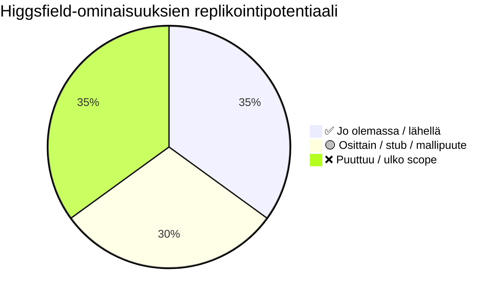
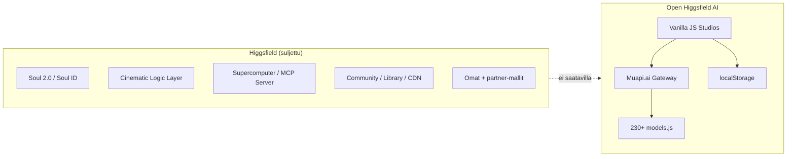
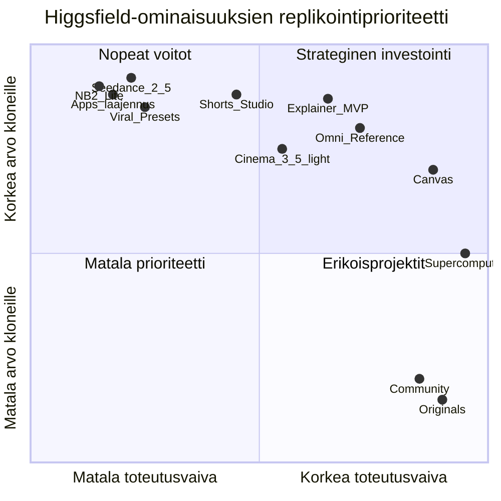

# Higgsfield.ai vs. Open Higgsfield AI — Ominaisuusgap-analyysi

> **Projekti:** Open Higgsfield AI (`C:/Projects/Open-Higgsfield-AI`)  
> **Päivämäärä:** 3.7.2026  
> **Lähteet:** [higgsfield.ai](https://higgsfield.ai/), alisivut, `REPOSITORY_GUIDE.md`, `MUAPI_FEATURED_MODELS_ANALYSIS.md`, lähdekoodi  
> **Tarkoitus:** Kartoittaa mitä [Higgsfield.ai](https://higgsfield.ai/) tarjoaa ja mitä voimme realistisesti jäljitellä Muapi.ai-API:lla

---

## Sisällysluettelo

1. [Tiivistelmä](#1-tiivistelmä)
2. [Navigaatiovertailu](#2-navigaatiovertailu)
3. [Yhteenvetotaulukko](#3-yhteenvetotaulukko)
4. [Higgsfield-ominaisuuskatalogi](#4-higgsfield-ominaisuuskatalogi)
5. [Nykytila Open Higgsfield AI:ssa](#5-nykytila-open-higgsfield-aissa)
6. [Ominaisuuskohtainen gap-analyysi](#6-ominaisuuskohtainen-gap-analyysi)
7. [Realistinen soveltamisala](#7-realistinen-soveltamisala)
8. [Toteutusroadmap](#8-toteutusroadmap)
9. [Liite: Higgsfield-sivuston URL-kartta](#9-liite-higgsfield-sivuston-url-kartta)

---

## 1. Tiivistelmä

[Higgsfield.ai](https://higgsfield.ai/) on suljettu, pilvipohjainen AI-luovastudio, jossa on **omia malleja** (Soul 2.0, Higgsfield DOP, Keyframes), **agentti-infrastruktuuri** (Supercomputer, MCP), **yhteisöalusta** (25M+ käyttäjää) ja **tuotantoputket** (Explainer, Shorts Studio, Marketing Studio, Cinema Studio 3.5, Canvas).

**Open Higgsfield AI** on avoimen lähdekoodin, paikallisesti ajettava vaihtoehto, joka reitittää generoinnin **[Muapi.ai](https://muapi.ai)**-gatewayn kautta. Ydin studiot (Image, Video, Cinema, Audio, Lip Sync, Apps) ovat jo olemassa, mutta Higgsfieldin **workflow-automaatio**, **monivaiheiset studiot** ja **alustaominaisuudet** puuttuvat lähes kokonaan.

**Keskeinen johtopäätös:** Parhaat jäljiteltävät ominaisuudet ovat ne, joissa Muapi tarjoaa vastaavat mallit ja joihin riittää uusi ohut UI-kerros olemassa olevan studion päälle. Vaikeimmat ovat Higgsfieldin oma backend (Soul ID -koulutus, agentti-orchestraatio, yhteisö, Originals-streaming).



---

## 2. Navigaatiovertailu

### 2.1 Higgsfield.ai — päänavigaatio ja featured-tuotteet

Etusivun ja sivukartan perusteella Higgsfieldin päätuotteet:

| Alue | Ominaisuudet |
|------|-------------|
| **Generointi** | Image, Video, Audio |
| **Studiot** | Cinema Studio 3.5, Canvas, Marketing Studio, Shorts Studio, Explainer |
| **Agentit & integraatiot** | Supercomputer, MCP & CLI |
| **Sisältö & yhteisö** | Explore, Community, Library, Profile, Originals / Arena Zero |
| **Työkalut** | Apps (40+), Viral Presets, Plugins (Adobe/Photoshop) |
| **Hahmot & sosiaalinen** | AI Influencer, Soul Cast / Soul ID |
| **Featured (2026)** | Explainer, Shorts Studio, Gemini Omni Flash, Nano Banana 2 Lite, Seed Audio 1.0, Seedance 2.0 4K, Supercomputer, Cinema Studio 3.5, Viral Presets |

### 2.2 Open Higgsfield AI — nykyinen navigaatio

`Header.js` + `main.js` reitit:

| Nav-linkki | Reitti | Komponentti |
|------------|--------|-------------|
| Image | `image` | ImageStudio |
| Video | `video` | VideoStudio |
| Lip Sync | `lipsync` | LipSyncStudio |
| Audio | `audio` | AudioStudio |
| Edit | `edit` | EditCanvas |
| Character | `character` | CharacterBuilder |
| Vibe Motion | `vibemotion` | VibeMotion |
| Cinema Studio | `cinema` | CinemaStudio |
| AI Influencer | `influencer` | AIInfluencer |
| Apps | `apps` | AppsGallery |
| Assist | `assist` | AssistChat |
| Seedance | `seedance` | SeedanceStudio |
| Explore | — | **Ei toimintoa** |
| Contests | — | **Ei toimintoa** |
| Community | — | **Ei toimintoa** |

### 2.3 Mermaid: nav vs. nav

```mermaid
flowchart TB
    subgraph HF["Higgsfield.ai nav"]
        HF_Home[Home / Generate]
        HF_Explore[Explore]
        HF_Image[Image]
        HF_Video[Video]
        HF_Audio[Audio]
        HF_Cinema[Cinema Studio 3.5]
        HF_Canvas[Canvas]
        HF_Marketing[Marketing Studio]
        HF_Shorts[Shorts Studio]
        HF_Explainer[Explainer]
        HF_Apps[Apps 40+]
        HF_Presets[Viral Presets]
        HF_Influencer[AI Influencer]
        HF_Super[Supercomputer]
        HF_MCP[MCP & CLI]
        HF_Originals[Originals / Arena Zero]
        HF_Community[Community]
        HF_Library[Library / Profile]
        HF_Plugins[Adobe / Photoshop Plugins]
    end

    subgraph OH["Open Higgsfield AI nav"]
        OH_Image[Image ✅]
        OH_Video[Video ✅]
        OH_Lipsync[Lip Sync ✅]
        OH_Audio[Audio 🟡]
        OH_Edit[Edit Canvas ✅]
        OH_Char[Character ✅]
        OH_Vibe[Vibe Motion ✅]
        OH_Cinema[Cinema Studio 🟡]
        OH_Influencer[AI Influencer 🟡]
        OH_Apps[Apps 🟡]
        OH_Assist[Assist 🟡]
        OH_Seedance[Seedance 🟡]
        OH_Explore[Explore ❌]
        OH_Contests[Contests ❌]
        OH_Community[Community ❌]
    end

    HF_Image -.->|917_Image
    HF_Video -.-> OH_Video
    HF_Audio -.-> OH_Audio
    HF_Cinema -.-> OH_Cinema
    HF_Apps -.-> OH_Apps
    HF_Influencer -.-> OH_Influencer
    HF_Super -.-> OH_Assist
    HF_Shorts -.-> OH_Vibe
    HF_Explainer -.-> OH_Assist
    HF_Marketing -.-> OH_Influencer
    HF_Canvas -.-> OH_Edit
    HF_Presets -.-> OH_Apps
    HF_MCP -.-> OH_Assist
    HF_Originals -.-> OH_Community
    HF_Explore -.-> OH_Explore
    HF_Library -.-> OH_Community
```

---

## 3. Yhteenvetotaulukko

| Higgsfield-ominaisuus | Meidän tila | Suositus | Prioriteetti |
|----------------------|-------------|----------|--------------|
| Image Studio | ✅ | Päivitä oletusmallit (NB2 Lite, Flux Klein turbo) | Korkea |
| Video Studio | ✅ | Lisää Seedance 2.5/mini, Gemini Omni, 4K-tier | Korkea |
| Audio Studio | 🟡 | Seed Audio / multi-speaker puuttuu; SFX tyhjä | Keskitaso |
| Lip Sync | ✅ | — | Matala |
| Cinema Studio 3.5 | 🟡 | Laajenna genre/mood/elements; ei Mr. Higgs -agenttia | Keskitaso |
| Seedance 2.0 4K | 🟡 | SeedanceStudio + VideoStudio osittain; uudet tierit puuttuvat | Korkea |
| Apps (40+) | 🟡 | 18 appia vs. 40+; laajenna appsList.js | Korkea |
| Viral Presets | 🟡 | VFX/motion-controls osittain Appsissa; ei preset-galleriaa | Keskitaso |
| Edit / Canvas | 🟡 | EditCanvas inpaint; ei node-pohjaista Canvasia | Keskitaso |
| Character / Soul ID | 🟡 | CharacterBuilder (PuLID); ei gemini-omni-character | Korkea |
| AI Influencer | 🟡 | Perustoiminto; ei avatar-kirjastoa / URL-to-ad | Keskitaso |
| Vibe Motion | ✅ | Lähin Shorts Studio -vastine; laajenna hook/audio | Keskitaso |
| Assist | 🟡 | LLM-chat; ei generointia tai Skills | Keskitaso |
| Explainer | ❌ | Uusi studio: LLM → kohtaukset → video + captions | Korkea |
| Shorts Studio | ❌ | Uusi studio tai VibeMotion-laajennus | Korkea |
| Gemini Omni Flash | ❌ | Uusi multimodaalinen video-studio | Keskitaso |
| Seed Audio 1.0 | ❌ | Multi-speaker TTS/audio-scene | Keskitaso |
| Marketing Studio | ❌ | URL → ad -pipeline; osittain MCP:ssä Higgsfieldillä | Matala–keski |
| Supercomputer | ❌ | Agentti-orchestraatio; ulko scope | Matala |
| MCP & CLI | ❌ | Oma MCP-palvelin Muapille mahdollinen erillisprojekti | Matala |
| Plugins (Adobe) | ❌ | Desktop-laajennukset; eri tuote | Matala |
| Originals / Arena Zero | ❌ | Streaming-alusta; ulko scope | Ei |
| Community / Explore | ❌ | Sosiaalinen feed; vaatii backendin | Ei |
| Library / Profile | 🟡 | localStorage-historia; ei pilvitiliä | Matala |

**Legenda:** ✅ = toimii hyvin · 🟡 = osittain / stub · ❌ = puuttuu

---

## 4. Higgsfield-ominaisuuskatalogi

Tutkimus perustuu [higgsfield.ai](https://higgsfield.ai/) etusivuun, navigaatio-URL:eihin ja landing-sivuihin.

### 4.1 Ydin-generointi

| Ominaisuus | Mitä se tekee | Lähde |
|-----------|---------------|-------|
| **Image** | T2I/I2I, 30+ mallia; Soul 2.0, Nano Banana Pro/2 Lite, GPT Image 2, Flux | [higgsfield.ai](https://higgsfield.ai/) |
| **Video** | T2V/I2V/V2V; Kling 3.0, Veo 3.1/4, Seedance 2.0, Sora 2, Wan | [ai-video](https://higgsfield.ai/ai-video) |
| **Audio** | TTS, musiikki, Seed Audio 1.0 multi-speaker -kohtaukset | [higgsfield.ai](https://higgsfield.ai/) |

### 4.2 Featured-tuotteet (etusivu 2026)

| Tuote | Kuvaus |
|-------|--------|
| **Higgsfield Explainer** | Aihe → tekstitetty selitysvideo, jopa 10 min | [higgsfield.ai](https://higgsfield.ai/) |
| **Higgsfield Shorts Studio** | "Click once. Watch it transform." — yhden klikkauksen short-form -muunnos | [higgsfield.ai](https://higgsfield.ai/) |
| **Gemini Omni Flash** | Generoi ja editoi videota mistä tahansa syötteestä (teksti/kuva/video/ääni) | [higgsfield.ai](https://higgsfield.ai/) |
| **Nano Banana 2 Lite** | Nopea T2I, terävä teksti kuvassa | [higgsfield.ai](https://higgsfield.ai/) |
| **Seed Audio 1.0** | Monipuhuja-kohtaukset puheella ja ambientilla | [higgsfield.ai](https://higgsfield.ai/) |
| **Seedance 2.0 4K** | Korkealaatuinen video sekunneissa; nyt 4K-tuki | [higgsfield.ai](https://higgsfield.ai/) |
| **Cinema Studio 3.5** | Täysi AI-tuotantostudio: kamera, linssi, valo, hahmot, propsit, yhteistyö | [cinematic-video-generator](https://higgsfield.ai/cinematic-video-generator) |
| **Supercomputer** | Agentti-chat: suunnittelee, valitsee mallit, tuottaa valmiin assetin | [supercomputer-intro](https://higgsfield.ai/supercomputer-intro) |
| **MCP & CLI** | Claude/Cursor-agentit + `@higgsfield/cli` — generointi ulkoisesta agentista | [mcp](https://higgsfield.ai/mcp) |
| **Viral Presets** | 40+ valmiita VFX-tyylejä (BASEBALL GAME, STORM GIANT, jne.) | [higgsfield.ai](https://higgsfield.ai/) |

### 4.3 Studiot ja workflow-työkalut

| Studio | Mitä se tekee | Lähde |
|--------|---------------|-------|
| **Marketing Studio** | Tuote-URL → UGC/CGI/TV Spot -mainos; 100+ avataria; Seedance 2.0 -moottori | [marketing-studio-intro](https://higgsfield.ai/marketing-studio-intro) |
| **Canvas** | Node-pohjainen infinite canvas; ketjuta prompt → kuva → video; Figma-tyylinen yhteistyö | [canvas-intro](https://higgsfield.ai/canvas-intro) |
| **AI Video Editor** | Trim by text, restyle, caption, 74+ kielen lokalisointi | [ai-video-editor](https://higgsfield.ai/ai-video-editor) |
| **Short Video Generator** | Prompt → Reels/TikTok/Shorts; hook-first, natiivi audio | [ai-short-video-generator](https://higgsfield.ai/ai-short-video-generator) |

### 4.4 Apps ([higgsfield.ai/apps](https://higgsfield.ai/apps))

Higgsfield listaa **21+ suositeltua appia** ja useita kategorioita:

| Kategoria | Esimerkkejä |
|-----------|-------------|
| Professional | Virality Predictor, Angles 2.0, Shots, Expand image |
| Enhance & Style | Skin Enhancer, AI Stylist, Relight, Outfit Swap |
| Face & Identity | Face Swap, Character Swap 2.0, Recast, Video Face Swap |
| Video Editing | ClipCut, Urban Cuts, Video Background Remover |
| Ads & Products | Click to Ad, Billboard Ad, Bullet Time Scene |
| Games & Characters | Game Dump, Plushies, Simlife |
| Trending Templates | On Fire, Skibidi, Mukbang, Idol |

### 4.5 Alusta & ekosysteemi

| Ominaisuus | Mitä se tekee |
|-----------|---------------|
| **Originals / Arena Zero** | Ensimmäinen AI-sarja-streaming; 10 min sci-fi-pilotti | [blog-original-series](https://higgsfield.ai/blog/blog-original-series) |
| **Community** | Julkaise, tykkää, tutki muiden generointeja | [community](https://higgsfield.ai/community) |
| **Higgsfield Earn** | Luojien monetisointi, kilpailut | [about](https://higgsfield.ai/about) |
| **Plugins** | Adobe Photoshop -integraatio | [mcp](https://higgsfield.ai/mcp) (footer-linkit) |
| **Enterprise / Team** | Tiimit, yhteistyö, laskutus | [enterprise](https://higgsfield.ai/enterprise) |

### 4.6 Higgsfieldin oma teknologia (ei Muapissa)

[About-sivun](https://higgsfield.ai/about) mukaan Higgsfield kehittää:

- **Soul 2.0** — photorealistinen kuva + hahmojohdonmukaisuus
- **Soul Cinema** — elokuvallinen kuvagenerointi
- **Higgsfield DOP** — elokuvallinen video
- **Keyframes** — AI-storyboard
- **Soul ID / Soul Cast** — hahmokoulutus ja -toisto
- **Cinematic logic layer** — narratiivi, kamera, pacing ennen generointia
- **Mr. Higgs** — Cinema Studio -ko-director

Nämä eivät ole suoraan saatavilla Muapi.ai:n kautta.

---

## 5. Nykytila Open Higgsfield AI:ssa

### 5.1 Studiot — yksityiskohtainen kartta

| Komponentti | Toteutustaso | Huomiot |
|-------------|-------------|---------|
| **ImageStudio** | ✅ Vahva | 46 T2I + 57 I2I; dynaaminen UI; multi-image I2I |
| **VideoStudio** | ✅ Vahva | T2V/I2V/V2V; extend/remix Seedance |
| **CinemaStudio** | 🟡 Perustaso | Kamera/linssi/focal/aperture → prompt; kovakoodattu `nano-banana-pro`; versio "2.0" UI:ssa, ei 3.5-ominaisuuksia |
| **LipSyncStudio** | ✅ | 9 mallia |
| **AudioStudio** | 🟡 | TTS (Minimax) + Suno-musiikki; **SFX tyhjä** |
| **EditCanvas** | ✅ | Inpaint, erase, outpaint; mask-canvas |
| **AppsGallery** | 🟡 | **18 appia** staattisessa `appsList.js` |
| **CharacterBuilder** | 🟡 | PuLID + LLM-backstory; paikallinen kirjasto |
| **AIInfluencer** | 🟡 | Alustakohtainen some-sisältö hahmoista; ei avatar-kirjastoa |
| **VibeMotion** | ✅ | Motion preset + I2V + valinnainen Suno-mood |
| **SeedanceStudio** | 🟡 | Character Swap, Remix, Variations; `seedance-v2.0-i2v` |
| **AssistChat** | 🟡 | LLM-copilot (`any-llm`); **ei generoi mediaa** |

### 5.2 Puuttuvat nav-linkit (stub)

`Header.js`: **Explore**, **Contests**, **Community** — renderöityvät ilman `onclick`-käsittelijää.

### 5.3 Muapi-mallien integraatiogap

`MUAPI_FEATURED_MODELS_ANALYSIS.md`: Featured-katalogista **~44 % puuttuu** `models.js`:stä. Erityisesti:

- `nano-banana-2-lite` ❌
- `seedance-2-mini`, `seedance-2.5`, VIP-4K ❌
- `gemini-omni-*` ❌
- `seed-audio` / multi-speaker ❌
- `kling-v3-turbo`, `kling-o3-image` ❌

---

## 6. Ominaisuuskohtainen gap-analyysi

### 6.1 Päätaulukko

| Higgsfield-ominaisuus | Mitä se tekee | Meidän tila | Muapi-mallit / API | Vaikeus | Prioriteetti |
|----------------------|---------------|-------------|-------------------|---------|--------------|
| **Image Studio** | T2I/I2I, multi-ref, teksti kuvassa | ✅ | `nano-banana-2-lite`, `flux-2-klein-turbo`, `kling-o3-image` | Matala | Korkea |
| **Video Studio** | T2V/I2V/V2V, extend, 4K | ✅ | `seedance-2.5-*`, `kling-v3-turbo`, `veo-4`, `grok-imagine-extend` | Matala–keski | Korkea |
| **Nano Banana 2 Lite** | Nopea budjetti-T2I, terävä teksti | ❌ malli | `nano-banana-2-lite`, `-lite-edit` | Matala | Korkea |
| **Seedance 2.0 4K** | Flagship-video, natiivi audio | 🟡 | `seedance-2.5-*`, `seedance-2-vip-*-4k` | Keski | Korkea |
| **Gemini Omni Flash** | Multimodaalinen video mistä tahansa inputista | ❌ | `gemini-omni-t2v/i2v/v2v`, `gemini-omni-character` | Korkea | Keskitaso |
| **Seed Audio 1.0** | Multi-speaker puhe + ambience | ❌ | Tarkista Muapi: `seed-audio` / vastaavat; TTS-ketjutus fallback | Korkea | Keskitaso |
| **Cinema Studio 3.5** | Hahmot, propsit, genre, Mr. Higgs, yhteistyö | 🟡 | `nano-banana-pro`, Seedance/Kling/Veo + `AssistChat` LLM | Korkea | Keskitaso |
| **Explainer** | Aihe → 10 min tekstitetty selitysvideo | ❌ | LLM (`any-llm`) + TTS + T2V/I2V + `ai-captions` + `video-combiner` | Korkea | Korkea |
| **Shorts Studio** | Yhden klikkauksen short-muunnos | ❌ | I2V/T2V 9:16 + Suno + `ai-captions` + `ai-clipping` | Keski–korkea | Korkea |
| **Viral Presets** | 40+ VFX-tyylipresettiä | 🟡 | `vfx`, `motion-controls`, `ai-video-effects` + preset-kartta | Matala–keski | Keskitaso |
| **Apps (40+)** | One-click-efektit | 🟡 | `appsList.js` + `muapi.runApp()`; laajenna endpoint-listaa | Matala | Korkea |
| **Canvas** | Node-pohjainen workflow-grafi | ❌ | Sama Muapi-kutsut solmuina; vaatii uuden editorin | Korkea | Keskitaso |
| **Edit Canvas** | Inpaint/erase/outpaint | ✅ | `nano-banana-2-edit`, `seedream-5.0-edit` | — | — |
| **Character / Soul ID** | Koulutettava, toistettava hahmo | 🟡 | `gemini-omni-character`, `seedance-2-character`, Flux PuLID | Keski | Korkea |
| **AI Influencer** | Some-sisältö hahmoista | 🟡 | ImageStudio + characterLibrary | Matala | Keskitaso |
| **Marketing Studio** | URL → mainos, avatarit, UGC/CGI-moodit | ❌ | Seedance I2V + TTS + tuoteskrapaus (oma) + CharacterBuilder | Korkea | Matala–keski |
| **Vibe Motion** | Kuva + liike + mood-musiikki | ✅ | Kling I2V + Suno | — | — |
| **Assist / Mr. Higgs** | Luova copilot | 🟡 | `any-llm`; ei generointia | Keski | Keskitaso |
| **Supercomputer** | Multi-agentti, Skills, Connectors, ajastus | ❌ | Vaatii agentti-backendin; AssistChat ei riitä | Erittäin korkea | Matala |
| **MCP & CLI** | Ulkoiset agentit generoivat Higgsfieldillä | ❌ | Oma MCP-wrapper Muapi-yli mahdollinen | Korkea | Matala |
| **Plugins** | Photoshop/Adobe | ❌ | Erillinen desktop-laajennus | Erittäin korkea | Matala |
| **Originals / Arena Zero** | AI-streaming-alusta | ❌ | Ei relevantti open-source -klonille | — | Ei |
| **Community / Explore** | Sosiaalinen feed, kilpailut | ❌ | Vaatii backend + auth + CDN | Erittäin korkea | Ei |
| **Library / Profile** | Pilvihistoria, profiilit | 🟡 | localStorage (`muapi_history`, jne.) | Keski | Matala |
| **Lip Sync** | Portrait/video + audio | ✅ | 9 lipsync-mallia | — | — |
| **Contests / Earn** | Luojien kilpailut ja maksut | ❌ | Liiketoimintalogiikka | — | Ei |

### 6.2 Syväluotaus: korostetut ominaisuudet

#### Explainer

**Higgsfield:** "Any topic to a captioned explainer video, up to 10 minutes" — [higgsfield.ai](https://higgsfield.ai/)

**Mitä se todennäköisesti tekee:**
1. LLM jakaa aiheen osioihin / kohtauksiin
2. Generoi kuvat/videot per kohtaus
3. TTS-narratio + synkronoidut tekstitykset
4. Yhdistää klipit yhdeksi videoksi

**Meidän tila:** ❌ Ei vastaavaa studiota. `AssistChat` voi kirjoittaa storyboardin, mutta ei tuota videota.

**Replikointi Muapilla:**
- `muapi.callLLM()` → skripti + kohtauslista
- `generateImage()` / `generateI2V()` per kohtaus
- `generateAudio()` (TTS) per osio
- `ai-captions` + `video-combiner` (kun lisätty Appsiin)
- **Vaikeus:** Korkea (orchestraatio-UI, aikajana, progress)
- **Komponentti:** Uusi `ExplainerStudio.js`

#### Shorts Studio

**Higgsfield:** "Click once. Watch it transform." — [higgsfield.ai](https://higgsfield.ai/)

**Mitä se tekee:** Syöte (kuva/video/idea) → valmis 9:16 short hook-first -somemuodossa, audio mukana — [ai-short-video-generator](https://higgsfield.ai/ai-short-video-generator)

**Meidän tila:** ❌ Erillistä studiota ei ole. **VibeMotion** on lähin (I2V + preset + mood-musiikki).

**Replikointi:**
- Yhden napin flow: upload → auto 9:16 → I2V preset → Suno → captions
- Mallit: `seedance-2-mini-i2v`, `kling-v3-turbo-pro-i2v`
- **Komponentti:** Laajenna `VibeMotion.js` tai uusi `ShortsStudio.js`

#### Gemini Omni Flash

**Higgsfield:** "Generate and edit video from any input" — multimodaalinen syöte

**Meidän tila:** ❌ Ei Omni Reference -UI:ta (paitsi osittain SeedanceStudio Character Swap)

**Replikointi:**
- Mallit: `gemini-omni-t2v`, `gemini-omni-i2v`, `gemini-omni-v2v` (Muapi Featured)
- UI: multi-upload (kuva + video + audio) + `@image1`-syntax helper
- **Komponentti:** Uusi välilehti `VideoStudio`/`SeedanceStudio` — "Omni Reference"
- **Vaikeus:** Korkea (multimodaalinen input-schema)

#### Seed Audio 1.0

**Higgsfield:** "Multi-speaker scenes with speech and ambience"

**Meidän tila:** ❌ AudioStudio tukee vain yksittäistä TTS:ää ja Suno-musiikkia; SFX tyhjä

**Replikointi:**
- Etsi Muapista `seed-audio` / multi-speaker endpoint
- Fallback: useita TTS-kutsuja + `video-combiner` / audio-mix (client-side)
- **Komponentti:** Laajenna `AudioStudio.js` — "Scenes"-välilehti

#### Supercomputer

**Higgsfield:** Agentti-chat, Skills (`/montage`), Connectors (Slack, Notion), ajastetut tehtävät, Orchestrator — [supercomputer-intro](https://higgsfield.ai/supercomputer-intro)

**Meidän tila:** ❌ `AssistChat` on vain teksti-LLM ilman työkaluja

**Replikointi:** Käytännössä erillinen agentti-palvelin (tool calling → Muapi). **Ulko scope** nykyiselle frontend-only -arkkitehtuurille.

#### MCP & CLI

**Higgsfield:** `https://mcp.higgsfield.ai/mcp` + `@higgsfield/cli` — [mcp](https://higgsfield.ai/mcp)

**Meidän tila:** ❌

**Replikointi:** Rakennettavissa **erillisenä projektina**: MCP-server joka käärii Muapi-endpointit. Open Higgsfield UI ei korvaa tätä suoraan.

#### Marketing Studio

**Higgsfield:** URL → tuoteprofili → avatar → mode (UGC/TV Spot/Hyper Motion) → valmis mainos — [marketing-studio-intro](https://higgsfield.ai/marketing-studio-intro)

**Meidän tila:** ❌ Osittain `AIInfluencer` + `AppsGallery` (`ai-product-shot`)

**Replikointi:** Monivaiheinen wizard; Seedance 2.0 + CharacterBuilder + URL-scraper (client-side rajallinen)

#### Viral Presets

**Higgsfield:** 40+ nimettyä presetiä (BASEBALL GAME, STORM GIANT, jne.) — [higgsfield.ai](https://higgsfield.ai/)

**Meidän tila:** 🟡 `vfx`, `motion-controls`, `ai-video-effects` Appsissa; ei visuaalista preset-galleriaa

**Replikointi:** Preset-kartta `appsList.js` / uusi `presets.js` thumbnail-videoilla + `runApp()` / I2V

#### Cinema Studio 3.5

**Higgsfield:** Elements (@tags), genre, mood, Mr. Higgs, yhteistyö, color grading — [cinematic-video-generator](https://higgsfield.ai/cinematic-video-generator)

**Meidän tila:** 🟡 Peruskamera (`CameraControls`) + prompt builder; ei elements-, genre- tai collaboration-tasoa

**Replikointi vaiheittain:**
1. Genre/mood dropdown → prompt suffix (matala)
2. Character/location @tagit → characterLibrary (keski)
3. Mr. Higgs → AssistChat integraatio CinemaStudioon (keski)
4. Real-time collaboration (korkea, backend)

#### Canvas

**Higgsfield:** Node-grafi, multi-model, templates, Figma-yhteistyö — [canvas-intro](https://higgsfield.ai/canvas-intro)

**Meidän tila:** ❌ `EditCanvas` on mask-pohjainen editori, ei workflow-grafi

**Replikointi:** Uusi komponentti (React Flow / LiteGraph tms.) — suuri investointi

#### 4K Seedance 2.0

**Higgsfield:** "NOW IN 4K" — flagship-video — [higgsfield.ai](https://higgsfield.ai/)

**Meidän tila:** 🟡 `seedance-v2.0-*` ja `seedance-2.0-*` osittain; uudempi `seedance-2.5` / VIP-4K puuttuu

**Replikointi:** Päivitä `models.js` + resolution-picker VideoStudio/SeedanceStudio

---

## 7. Realistinen soveltamisala

### 7.1 Mitä VOIMME replikoida (Muapi + frontend)

| Kategoria | Esimerkkejä |
|-----------|------------|
| **Mallipohjainen generointi** | Image/Video/Audio/Lip Sync -studiot, uudet featured-mallit |
| **One-click Apps** | Laajentaa 18 → 40+ appia `appsList.js`:ään |
| **Preset-galleriat** | Viral Presets → I2V/VFX-app mapping |
| **Workflow-yksinkertaistus** | Shorts Studio, Explainer (yksinkertaistettu versio) |
| **Hahmojohdonmukaisuus** | CharacterBuilder + `gemini-omni-character` / `seedance-2-character` |
| **Paikallinen historia** | Library (localStorage), ei pilveä |
| **LLM-copilot** | AssistChat laajennus prompt + storyboard -työkaluiksi |

### 7.2 Mitä VOIMME osittain replikoida (yksinkertaistettu)

| Ominaisuus | Rajoite |
|-----------|---------|
| **Cinema Studio 3.5** | Genre/mood/kamera OK; ei team-collab |
| **Marketing Studio** | Manuaalinen tuote-upload; ei URL-scraper + 100 avataria |
| **Canvas** | Yksinkertainen lineaarinen pipeline, ei Figma-collab |
| **Gemini Omni** | Rajattu multi-ref, ei täyttä Higgsfield Omni UX:ää |
| **MCP** | Erillinen kevyt MCP-server Muapille (ei Higgsfield CLI -yhteensopivuus) |

### 7.3 Mitä EMME voi replikoida ilman Higgsfield-backendiä

| Ominaisuus | Syy |
|-----------|-----|
| **Soul 2.0 / Soul ID -koulutus** | Higgsfieldin proprietary pipeline ([about](https://higgsfield.ai/about)) |
| **Cinematic logic layer** | Higgsfieldin reasoning engine ennen generointia |
| **Supercomputer** | Multi-agent orchestrator, Connectors, Skills Marketplace |
| **Originals / Arena Zero** | Streaming-alusta + sisältöliiketoiminta |
| **Community / Earn / Contests** | Käyttäjätilit, maksut, moderointi, CDN |
| **Virality Predictor** | Higgsfieldin proprietary analyysi ([apps](https://higgsfield.ai/apps)) |
| **Adobe/Photoshop Plugins** | Erillinen desktop-integraatio |
| **25M käyttäjän ekosysteemi** | Skaala ja verkostovaikutus |

### 7.4 Arkkitehtuuriero



---

## 8. Toteutusroadmap

### Vaihe 1 — Nopeat voitot (1–2 viikkoa)

Olemassa olevat studiot + Muapi-mallit, minimaalinen uusi UI.

| # | Toimenpide | Komponentti | Muapi-mallit | Higgsfield UX -malli |
|---|-----------|-------------|--------------|---------------------|
| 1.1 | Lisää featured-mallit `models.js`:ään | `models.js` | `nano-banana-2-lite`, `flux-2-klein-*-turbo`, `seedance-2-mini`, `seedance-2.5`, `kling-v3-turbo` | [Nano Banana 2 Lite](https://higgsfield.ai/), [Seedance 2.0](https://higgsfield.ai/) |
| 1.2 | Päivitä oletusmallit | ImageStudio, VideoStudio | Lite/Turbo draft, 2.5 quality | Featured-etusiivu |
| 1.3 | Laajenna Apps 18 → 30+ | `appsList.js`, AppsGallery | watermark remover, autocrop, ai-clipping, relight, angles | [higgsfield.ai/apps](https://higgsfield.ai/apps) |
| 1.4 | Viral Presets -galleria | AppsGallery tai uusi Presets-välilehti | `vfx`, `motion-controls`, `ai-video-effects` + nimetty preset-kartta | [Viral Presets](https://higgsfield.ai/) |
| 1.5 | Seedance endpoint-päivitys | SeedanceStudio | `seedance-2-i2v` (uusi suku) | Seedance 2.0 4K |
| 1.6 | SFX-mallit takaisin | AudioStudio | Tarkista Muapi SFX-endpointit | Seed Audio (yksinkertaistettu) |

### Vaihe 2 — Uudet studiot (2–6 viikkoa)

Uudet komponentit tai merkittävät laajennukset.

| # | Ominaisuus | Komponentti | Muapi / logiikka | Higgsfield UX |
|---|-----------|-------------|------------------|---------------|
| 2.1 | **Shorts Studio** | `ShortsStudio.js` (tai VibeMotion) | I2V 9:16 + Suno + `ai-captions` | [Shorts Studio](https://higgsfield.ai/) |
| 2.2 | **Explainer (MVP)** | `ExplainerStudio.js` | LLM → kohtaukset → T2V/I2V + TTS + combiner | [Explainer](https://higgsfield.ai/) |
| 2.3 | **Omni Reference** | SeedanceStudio / VideoStudio tab | `seedance-2-omni-*`, `gemini-omni-*` | [Gemini Omni Flash](https://higgsfield.ai/) |
| 2.4 | **Character ID** | CharacterBuilder | `gemini-omni-character`, `seedance-2-character` | Soul Cast |
| 2.5 | **Cinema 3.5 light** | CinemaStudio | Genre/mood/elements @tag + AssistChat "Mr. Higgs" | [Cinema Studio 3.5](https://higgsfield.ai/cinematic-video-generator) |
| 2.6 | **Seed Audio scenes** | AudioStudio | Multi-speaker endpoint tai TTS-ketju | [Seed Audio 1.0](https://higgsfield.ai/) |
| 2.7 | **Marketing Wizard (MVP)** | AIInfluencer / uusi MarketingStudio | Product upload + avatar + Seedance I2V | [Marketing Studio](https://higgsfield.ai/marketing-studio-intro) |
| 2.8 | **Assist → Tool Calling** | AssistChat | LLM + wrapper-funktiot generateImage/Video | Supercomputer (yksinkertaistettu) |

### Vaihe 3 — Alustaominaisuudet (pitkä tähtäin)

| # | Ominaisuus | Realistisuus | Huomio |
|---|-----------|--------------|--------|
| 3.1 | **Canvas (node editor)** | Keski | Iso frontend-projekti; aloita lineaarinen pipeline |
| 3.2 | **MCP-server Muapille** | Keski | Erillinen repo; `@open-higgsfield/mcp` |
| 3.3 | **Library / Explore (paikallinen)** | Matala | localStorage + thumbnail-grid |
| 3.4 | **Supercomputer-taso** | Matala | Vaatii backend-agentin |
| 3.5 | **Community / Originals** | Ei suositella | Scope creep; eri tuote |
| 3.6 | **Desktop Plugins** | Ei suositella | Electron-app riittää |

### 8.1 Prioriteettikaavio



---

## 9. Liite: Higgsfield-sivuston URL-kartta

| URL | Ominaisuus |
|-----|-----------|
| [higgsfield.ai](https://higgsfield.ai/) | Etusivu, featured-tuotteet, Viral Presets |
| [higgsfield.ai/apps](https://higgsfield.ai/apps) | Apps-galleria |
| [higgsfield.ai/cinematic-video-generator](https://higgsfield.ai/cinematic-video-generator) | Cinema Studio 3.5 |
| [higgsfield.ai/canvas-intro](https://higgsfield.ai/canvas-intro) | Canvas |
| [higgsfield.ai/marketing-studio-intro](https://higgsfield.ai/marketing-studio-intro) | Marketing Studio |
| [higgsfield.ai/supercomputer-intro](https://higgsfield.ai/supercomputer-intro) | Supercomputer |
| [higgsfield.ai/mcp](https://higgsfield.ai/mcp) | MCP & CLI |
| [higgsfield.ai/ai-short-video-generator](https://higgsfield.ai/ai-short-video-generator) | Short-form / Shorts |
| [higgsfield.ai/ai-marketing-video-maker](https://higgsfield.ai/ai-marketing-video-maker) | Explainer / marketing video |
| [higgsfield.ai/ai-video-editor](https://higgsfield.ai/ai-video-editor) | Video editor |
| [higgsfield.ai/community](https://higgsfield.ai/community) | Community feed |
| [higgsfield.ai/about](https://higgsfield.ai/about) | Yritys, teknologia, skaala |

---

*Analyysi laadittu 3.7.2026 tutkimalla [higgsfield.ai](https://higgsfield.ai/) -sivustoa, Open Higgsfield AI -lähdekoodia ja `MUAPI_FEATURED_MODELS_ANALYSIS.md` -dokumenttia.*
