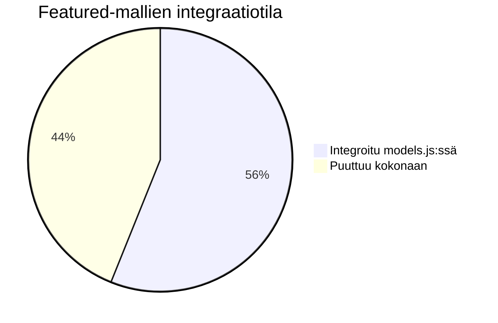
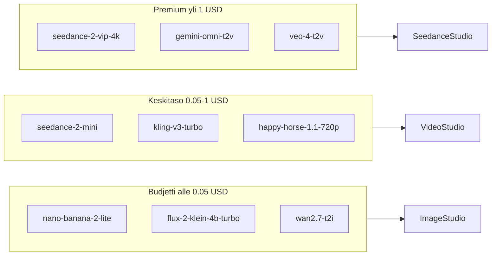
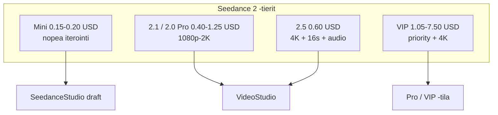
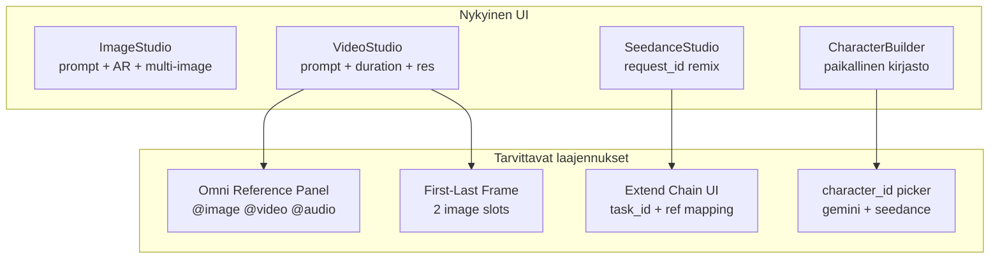
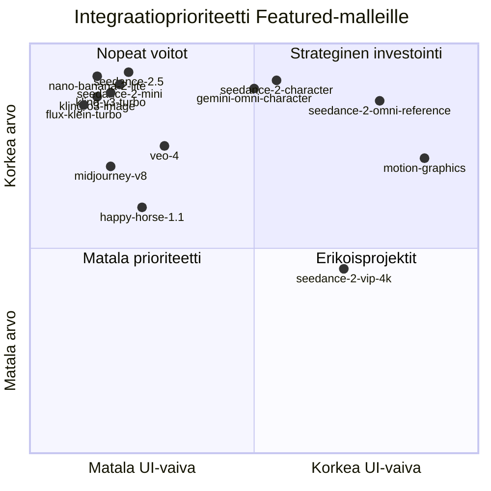

# Muapi Featured / Newly Added -mallikatalogin analyysi

> **Projekti:** Open Higgsfield AI  
> **Päivämäärä:** 3.7.2026  
> **Lähde:** Käyttäjän liittämä Muapi "Featured Models / Newly Added" -lista (hinnat, kategoriat, kuvaukset)  
> **Verifiointi:** `src/lib/models.js`, `src/lib/appsList.js`, studiokomponentit, `REPOSITORY_GUIDE.md`

---

## Sisällysluettelo

1. [Tiivistelmä](#1-tiivistelmä)
2. [Nykytila sovelluksessa](#2-nykytila-sovelluksessa)
3. [Katalogin rakenne](#3-katalogin-rakenne)
4. [Avainmallit syvällisesti](#4-avainmallit-syvällisesti)
5. [Perhekohtainen gap-analyysi](#5-perhekohtainen-gap-analyysi)
6. [Suositukset](#6-suositukset)
7. [UI-vaikutukset](#7-ui-vaikutukset)
8. [Studiokohtainen kartoitus](#8-studiokohtainen-kartoitus)
9. [Prioriteettikaavio](#9-prioriteettikaavio)

---

## 1. Tiivistelmä

Muapin Featured/Newly Added -katalogi sisältää **noin 200+ näkyvää mallia** (jäsennelty analyysi: **378 merkintää**, osa samaa perhettä eri resoluutio-/hintatierillä). Vertailu `models.js`:ään:

| Mittari | Arvo |
|---------|------|
| Featured-listan mallit (jäsennelty) | 378 |
| Jo `models.js`:ssä (täsmäävä `id`) | 212 (~56 %) |
| Puuttuu kokonaan | 166 (~44 %) |
| Nykyinen ydinmallien määrä (`models.js`) | ~230 (REPOSITORY_GUIDE) |

**Keskeinen havainto:** Featured-katalogi on **uudempi ja laajempi** kuin projektin `models_dump.json` / `models.js` -snapshot. Monet uudet mallit käyttävät **uutta nimeämiskäytäntöä** (`seedance-2-*` vs. vanha `seedance-v2.0-*` / `seedance-2.0-*`), mikä aiheuttaa osittaisen integraation illuusion.

**Strateginen johtopäätös:** Open Higgsfield AI on jo vahva yleisstudio (Image/Video/Cinema/LipSync/Apps), mutta Featured-lista paljastaa kolme selkeää kehityssuuntaa:

1. **Budjettitaso** — `nano-banana-2-lite`, `seedance-2-mini`, `flux-2-klein-turbo` korvaisivat kalliimpia oletuksia nopeaan iterointiin.
2. **Multimodaalinen syvyys** — Omni Reference (`@image1`), character_id, extend-ketjut, audio+video+image -referenssit vaativat erikoistunutta UI:ta (SeedanceStudio, CharacterBuilder).
3. **Uudet vendor-perheet** — Happy Horse, Gemini Omni, Kling O3/Omni/Turbo, Veo 4, Motion Graphics.

---

## 2. Nykytila sovelluksessa

### Studiot ja reititys (`main.js`)

| Studio | Reitti | Mallilähde | Huomio |
|--------|--------|------------|--------|
| **ImageStudio** | `image` | `t2iModels` / `i2iModels` | Dynaaminen dropdown, multi-image I2I |
| **VideoStudio** | `video` | `t2vModels` / `i2vModels` / `v2vModels` | T2V/I2V/V2V-tilat |
| **SeedanceStudio** | `seedance` | Kovakoodattu `seedance-v2.0-i2v` | Character Swap, Remix, Variations |
| **CinemaStudio** | `cinema` | `nano-banana-pro` (kovakoodattu) | Virtuaalikamera |
| **LipSyncStudio** | `lipsync` | `lipsyncModels` | Portrait + video -tilat |
| **VibeMotion** | `vibemotion` | Kling I2V (v2.x preferenssi) | Motion presetit |
| **CharacterBuilder** | `character` | Paikallinen kirjasto + generointi | Ei vielä `gemini-omni-character` / `seedance-2-character` |
| **AppsGallery** | `apps` | `appsList.js` | 15 käyttötyökalua |
| **EditCanvas** | `edit` | Rajattu I2I-lista | `nano-banana-2-edit`, `nano-banana-pro-edit` |

### Jo integroidut Featured-perheet (osittain tai kokonaan)

| Perhe | models.js | UI-studio | Featured-gap |
|-------|-----------|-----------|--------------|
| Nano Banana | `nano-banana`, `pro`, `2`, edit-variantit | ImageStudio, EditCanvas | **Lite** puuttuu |
| Seedance 2 | `seedance-2.0-*`, `seedance-v2.0-*`, `seedance-2-text-to-video` | VideoStudio, SeedanceStudio | **2.1/2.5/mini/VIP/pro/fast** -tierit puuttuvat |
| WAN 2.7 | T2I, T2V, I2V, I2I edit, video-extend | ImageStudio, VideoStudio | `video-edit`, `text-to-image-pro` puuttuu |
| Kling v3.0 | pro/standard T2V/I2V | VideoStudio | **Turbo, Omni, 4K, motion-control** puuttuu |
| Flux Klein | 4b/9b T2I + edit | ImageStudio | **turbo, lora** puuttuu |
| Grok Imagine | T2I, T2V, I2V, I2I | ImageStudio, VideoStudio | **1.5 preview, quality, extend** puuttuu |
| Midjourney | v7 T2I/I2I/I2V | ImageStudio, VideoStudio | **v8, niji** puuttuu |
| Pixverse v6 | T2V, I2V, extend, transition | VideoStudio | Osittain integroitu |
| Veo | 3.x, 3.1 4K | VideoStudio | **Veo 4, 3.1 Lite** puuttuu |
| Seedream 5 | `seedream-5.0` (≠ `bytedance-seedream-v5.0`) | ImageStudio | ID-epäjohdonmukaisuus |

---

## 3. Katalogin rakenne

### 3.1 Kategorioittain

| Kategoria | Määrä | Tyypillinen käyttö | Hintahaarukka (alennushinta) |
|-----------|-------|--------------------|------------------------------|
| **T2I** (Text to Image) | 63 | Kuvagenerointi, brändäys, teksti kuvassa | $0.004 – $0.10 |
| **I2I** (Image to Image) | 66 | Muokkaus, tyyli, multi-ref | $0 – $0.30 |
| **T2V** (Text to Video) | 80 | Tarinankerronta, mainokset | $0.05 – $7.50 |
| **I2V** (Image to Video) | 112 | Animaatio, tuotevideo | $0.05 – $7.50 |
| **V2V** (Video to Video) | 44 | Edit, extend, motion control | $0 – $2.67 |
| **A2V** (Audio to Video) | 13 | Lipsync, talking head | $0.20 – $0.29 |

### 3.2 Vendor-perheittäin

| Vendor | Määrä | Keskeinen rooli |
|--------|-------|-----------------|
| **ByteDance / Seedance** | 65 | SD 2 -ekosysteemi: mini → pro → VIP → 4K |
| **Kling** | 45 | v3 Turbo/Omni/4K, O3 image, motion control |
| **WAN (Alibaba)** | 31 | Budjetti T2I/T2V/I2V + edit/extend |
| **Flux** | 30 | Nopea Klein (4B/9B), turbo, LoRA |
| **Happy Horse** | 16 | Uusi stylized-video-perhe (T2V/I2V/R2V/V2V) |
| **Vidu** | 18 | Q2/Q3 turbo/pro, first-last-frames |
| **Google/Gemini** | 13 | Nano Banana Lite, Gemini Omni |
| **Google/Veo** | 15 | Veo 3.x Lite, **Veo 4** |
| **xAI/Grok** | 7 | Imagine + extend + 1.5 preview |
| **LTX** | 11 | 2.3 T2V/I2V/extend/lipsync |
| **Utility** | 19 | Captions, clipping, watermark, combiner |

### 3.3 Hintatierit

| Tier | Kriteeri | Esimerkit | Sopivuus OH AI:lle |
|------|----------|-----------|-------------------|
| **Ilmainen** | $0.00 | `gemini-omni-character`, `ai-captions`, watermark-työkalut | AppsGallery, oletuskäyttäjät |
| **Budjetti** | < $0.05 | `nano-banana-2-lite`, `flux-2-klein-4b-turbo`, `wan2.7-*` | **Oletusgenerointi** |
| **Keskitaso** | $0.05 – $1.00 | `seedance-2-mini`, `kling-v3-turbo`, `happy-horse-1.1-720p` | Päävalikoima |
| **Premium** | > $1.00 | `seedance-2-vip-4k`, `gemini-omni-*`, `kling-v3.0-4k`, `veo-4` | Pro-tila / erillinen "Cinema Pro" |

### 3.4 Kyvykkyystyypit

| Tyyppi | Kuvaus | Featured-esimerkit |
|--------|--------|-------------------|
| **Generointi** | Uusi sisältö promptista/kuvasta | T2I, T2V, I2V |
| **Muokkaus** | Olemassa olevan muutos | I2I, V2V edit |
| **Extend** | Videon jatko | `seedance-2-extend`, `grok-imagine-extend`, `wan2.7-video-extend` |
| **Reference/Omni** | Multi-ref + @syntax | `seedance-2-omni-reference`, `kling-v3.0-omni-*` |
| **Character** | character_id -ketju | `seedance-2-character`, `gemini-omni-character` |
| **Utility** | Post-prosessointi | watermark remover, autocrop, captions |

---

## 4. Avainmallit syvällisesti

### 4.1 Google / Nano Banana

| Malli | Hinta | Kyky | OH AI -sopivuus |
|-------|-------|------|-----------------|
| **nano-banana-2-lite** | $0.03 | Nopein T2I, 4K, teksti kuvassa, hahmojohdonmukaisuus | ⭐⭐⭐ **Must add** — budjettioletus ImageStudioon |
| **nano-banana-2-lite-edit** | $0.03 | 14 ref-kuvaa, nopea edit | ⭐⭐⭐ **Must add** — korvaa hitaamman `nano-banana-2-edit` draft-tilassa |
| nano-banana-2 / -edit | $0.06 | Täysi Nano Banana 2 | ✅ Jo integroitu |
| **gemini-omni-character** | Ilmainen | Luo uudelleenkäytettävä hahmo + ääni | ⭐⭐⭐ CharacterBuilderiin |
| **gemini-omni-t2v/i2v/v2v** | $1.50–2.40 | Natiivi multimodaali + synkronoitu ääni | ⭐⭐ Erikoisstudio; kallis |

### 4.2 ByteDance / Seedance 2 -ekosysteemi

| Malliryhmä | Hinta | Kyky | Integraatio |
|------------|-------|------|-------------|
| **seedance-2-mini-*** | $0.15–0.20 | 2× nopeampi kuin Fast, 720p | ❌ Puuttuu — **Must add** VideoStudioon |
| **seedance-2.1-*** | $0.40 | 1080p, parannettu liike | ❌ Puuttuu — **Should add** |
| **seedance-2.5-*** | $0.60 | 4K, 16s, natiivi audio | ❌ Puuttuu — **Must add** (korvaa v1.5/v2.0 flagship) |
| **seedance-2-{t2v,i2v,omni}-fast/pro** | $0.75–1.50 | 2K, audio, @image-syntax | ⚠️ Osittain (`seedance-2.0-*`, `seedance-v2.0-*`) |
| **seedance-2-vip-*** | $1.05–7.50 | Priority routing, 4K | ❌ Liian kallis oletukseksi; Pro-tila |
| **seedance-2-extend / vip-extend** | $1.05–2.62 | request_id -ketjutus | ⚠️ `seedance-v2.0-extend` on, uudet VIP-variantit puuttuvat |
| **seedance-2-character** | $0.18 | character_id Omni Referenceen | ❌ **Must add** CharacterBuilder + SeedanceStudio |
| **motion-graphics** | $0.63 | React/Remotion-animaatiot promptista | ❌ Uusi VibeMotion/Apps-kandidaatti |

**Huomio nimeämisestä:** SeedanceStudio käyttää `seedance-v2.0-i2v`, kun taas Featured-lista myy `seedance-2-i2v`, `seedance-2-image-to-video` jne. — todennäköisesti **sama tai uudempi endpoint-sukupolvi**.

### 4.3 Kling

| Malli | Hinta | Kyky | Suositus |
|-------|-------|------|----------|
| **kling-v3-turbo-pro/standard** | $0.56–0.70 | 3–15s, 720p/1080p, nopea | ⭐⭐⭐ **Must add** — päivittää v3.0-pro oletuksen |
| **kling-v3.0-omni-*** | $0.42–2.68 | `<<<image_N>>>` multi-ref | ⭐⭐ **Should add** + uusi multi-ref UI |
| **kling-v3.0-4k-*** | $2.00 | 4K T2V/I2V | ⭐ Pro-tila |
| **kling-o3-image / -edit** | $0.027–0.03 | 1K/2K/4K, 9 output, 10 ref | ⭐⭐⭐ **Must add** ImageStudioon |
| kling-v3.0-pro/standard | $0.72 | Perus v3 | ✅ Jo integroitu |
| **kling-v3.0-*-motion-control** | $0.10–0.16 | Kamera/subjekti-kontrolli | ⭐⭐ VibeMotion / VideoStudio V2V |

### 4.4 Happy Horse (uusi perhe)

Koko perhe **puuttuu** sovelluksesta. Stylized, expressive video — kilpailija Seedancelle/Klingille eri estetiikalla.

| Variantti | Hinta | Käyttö |
|-----------|-------|--------|
| 1.1 T2V/I2V 720p | $0.70–0.90 | Sosiaalinen sisältö, hahmoveto |
| 1.1 Reference-to-Video | $0.70–1.00 | 1–9 ref-kuvaa |
| 1.1 Video Edit | $0.70–1.00 | NL-videoedit |
| 1.0 variantit | $0.90–2.10 | Vanhempi sukupolvi |

**Suositus:** **Should add** 2–4 edustajamallia (esim. `happy-horse-1.1-text-to-video-720p`, `happy-horse-1.1-image-to-video-720p`) VideoStudioon. Ei oletukseksi — niche-tyyli.

### 4.5 Flux Klein -laajennus

| Malli | Hinta | vs. nykyinen |
|-------|-------|--------------|
| flux-2-klein-4b/9b | $0.010–0.021 | ✅ Integroitu |
| **flux-2-klein-*-turbo** | $0.005–0.010 | ❌ 2× nopeampi — **Must add** draft-T2I |
| **flux-2-klein-*-lora** | $0.020–0.030 | ❌ Custom LoRA — **Should add** (vaatii LoRA-parametrit) |

### 4.6 WAN 2.7

| Malli | Integroitu | Puuttuu |
|-------|------------|---------|
| wan2.7-text-to-video | ✅ | — |
| wan2.7-image-to-video | ✅ | — |
| wan2.7-image-edit / -pro | ✅ | — |
| wan2.7-video-extend | ✅ (v2v) | — |
| **wan2.7-text-to-image** | ❌ | Budjetti-T2I ($0.05) |
| **wan2.7-text-to-image-pro** | ❌ | 4K + thinking mode |
| **wan2.7-video-edit** | ❌ | Prompt-driven V2V ($0.10) |

### 4.7 Veo & Grok & Midjourney & GPT Image

| Malli | Hinta | Suositus |
|-------|-------|----------|
| **veo-4-t2v/i2v** | $3.00 | ⭐ Should add (korkealaatuinen flagship) |
| veo3.1-lite-* | $0.30 | ⭐⭐ Should add (budjetti-Veo) |
| **grok-imagine-video-1-5-preview** | $0.64 | ⭐⭐ Should add I2V |
| grok-imagine-extend | $0.05 | ⭐⭐ VideoStudio extend-työkalu |
| **midjourney-v8 / niji** | $0.10 | ⭐⭐ Should add T2I (4 kuvaa/ajo) |
| **gpt-image-2-t2i/i2i** | $0.09 | ⭐⭐ Should add (20k prompt, 16 ref) |

### 4.8 Vidu Q2/Q3

| Tier | Hinta | Käyttö |
|------|-------|--------|
| Q2/Q3 Turbo | $0.13–0.30 | Nopea storyboard |
| Q3 Pro | $0.75 | First-last-frames, 1080p |

**Suositus:** **Should add** `vidu-q3-turbo-*` ja `vidu-q3-pro-first-last-frames` — first-last-frame on erinomainen VideoStudio/I2V-laajennus.

### 4.9 Utility / Apps-kandidaatit

| Malli | Hinta | Nykyinen appsList |
|-------|-------|-------------------|
| seedance-2-watermark-remover | Ilmainen (raj.) | ❌ Puuttuu |
| seedance-2-video-watermark-remover-pro | $0.065/5s | ❌ (v2v: `video-watermark-remover`) |
| autocrop | $0.05 | ❌ |
| video-combiner | $0.05 | ❌ |
| ai-captions | $0.00 | ✅ `ai-captions` appsListissä |
| ai-clipping | $0.50 | ❌ |
| photo-pack | $0.30 | ❌ |
| tiktok-carousel | $0.028 | ❌ |
| portrait-stylist | $0.01 | ✅ appsListissä |
| omnihuman-1-5 | $0.25 | ❌ (LipSync-vaihtoehto) |

---

## 5. Perhekohtainen gap-analyysi

| Perhe | models.js | UI | Puuttuu / korkea arvo | Liian kallis / niche |
|-------|-----------|-----|----------------------|---------------------|
| **Nano Banana Lite** | ❌ | — | T2I + I2I lite | — |
| **Seedance 2 uusi suku** | ⚠️ Osittain | VideoStudio, SeedanceStudio | mini, 2.1, 2.5, pro/fast, omni, character | VIP 4K ($6.75+) |
| **Happy Horse** | ❌ | — | 1.1 T2V/I2V 720p | 1080p edit ($0.90+) oletuksena |
| **Kling v3 Turbo/Omni/O3** | ⚠️ v3.0 pro/std | VideoStudio, ImageStudio | turbo, omni, o3-image, 4k | Omni 4K ($2.68) |
| **Gemini Omni** | ❌ | — | character (ilmainen!), t2v/i2v | video-edit ($2.40) |
| **Flux Klein turbo/lora** | ⚠️ 4b/9b | ImageStudio | turbo, lora | LoRA vaatii lisäparametrit |
| **WAN 2.7** | ✅ Suurin osa | Image/Video Studio | t2i, video-edit | — |
| **Veo** | ⚠️ 3.x | VideoStudio | **veo-4**, 3.1 lite | Veo 4 ($3) oletuksena |
| **Grok Imagine** | ✅ Perus | Image/Video | 1.5 preview, quality, extend | — |
| **Midjourney** | ⚠️ v7 | ImageStudio | **v8, niji** | — |
| **GPT Image** | ⚠️ 1.5 | ImageStudio | **gpt-image-2** | — |
| **Vidu Q3** | ⚠️ Q2 t2i | — | Q2/Q3 turbo/pro, first-last | — |
| **LTX 2.3** | ⚠️ lipsync | LipSyncStudio | t2v, i2v, extend | — |
| **Motion Graphics** | ❌ | — | motion-graphics + edit | Erikois-UI (koodi/Remotion) |
| **Utilities** | ⚠️ Osittain | AppsGallery | watermark, autocrop, combiner, clipping | — |

---

## 6. Suositukset

### 6.1 Must add — selkeät aukot tai oletuspäivitykset

| Malli-ID | Kohde-studio | Perustelu |
|----------|--------------|-----------|
| `nano-banana-2-lite` | ImageStudio (T2I oletus draft) | Puoleen hintaan vs. NB2, 4s generointi |
| `nano-banana-2-lite-edit` | ImageStudio (I2I draft) | 14 ref, nopea edit |
| `seedance-2-mini-text-to-video` | VideoStudio | Budjetti-T2V korvaamaan `seedance-lite-t2v` |
| `seedance-2-mini-image-to-video` | VideoStudio, SeedanceStudio | Nopea I2V draft |
| `seedance-2.5-text-to-video` | VideoStudio (quality oletus) | 4K + 16s + audio — uusi flagship |
| `seedance-2.5-image-to-video` | VideoStudio | Vastaava I2V flagship |
| `seedance-2-character` | CharacterBuilder | character_id → Omni Reference |
| `seedance-2-extend` | VideoStudio / SeedanceStudio | Uusi extend (request_id UI jo olemassa Remixissä) |
| `kling-v3-turbo-pro-text-to-video` | VideoStudio | Nopeampi v3 kuin pro/standard |
| `kling-v3-turbo-pro-image-to-video` | VideoStudio, VibeMotion | Päivitä VibeMotion preferenssi |
| `kling-o3-image` | ImageStudio | Halpa, 4K, 9 output |
| `kling-o3-image-edit` | ImageStudio, EditCanvas | 10 ref, luonnollinen edit |
| `flux-2-klein-4b-turbo` | ImageStudio | Nopein budjetti-T2I |
| `flux-2-klein-9b-turbo` | ImageStudio | Laadukkaampi nopea T2I |
| `gemini-omni-character` | CharacterBuilder | Ilmainen, ääniprofiili |

### 6.2 Should add — hyvä fit, alempi prioriteetti

| Malli-ID | Kohde | Perustelu |
|----------|-------|-----------|
| `seedance-2.1-*` | VideoStudio | Väliportaas 2.0 → 2.5 |
| `seedance-2-{t2v,i2v,omni}-fast` | VideoStudio | Halvempi kuin pro |
| `kling-v3.0-omni-pro-*` | VideoStudio | Multi-ref video |
| `happy-horse-1.1-text-to-video-720p` | VideoStudio | Uusi tyyliperhe |
| `happy-horse-1.1-image-to-video-720p` | VideoStudio | Stylized I2V |
| `veo3.1-lite-text-to-video` | VideoStudio | Budjetti-Google-video |
| `veo-4-text-to-video` | VideoStudio (Pro) | Top-tier laatu |
| `grok-imagine-video-1-5-preview` | VideoStudio I2V | 15s, uusi preview |
| `grok-imagine-extend` | VideoStudio V2V | Halpa extend |
| `midjourney-v8` | ImageStudio | Päivitys v7:ään |
| `midjourney-niji` | ImageStudio | Anime-erikoisuus |
| `gpt-image-2-text-to-image` | ImageStudio | Pitkät promptit |
| `gpt-image-2-image-to-image` | ImageStudio | 16 ref edit |
| `vidu-q3-turbo-text-to-video` | VideoStudio | Nopea storyboard |
| `vidu-q3-pro-first-last-frames` | VideoStudio I2V | Keyframe-interpolointi |
| `wan2.7-text-to-image` | ImageStudio | Budjetti-T2I |
| `wan2.7-video-edit` | VideoStudio V2V | Halpa videoedit |
| `ltx-2.3-text-to-video` | VideoStudio | Budjetti cinematic |
| `flux-2-klein-*-lora` | ImageStudio | Vaatii LoRA-kentät |
| `motion-graphics` | Uusi "Motion Studio" tai Apps | Uniikki kyvykkyys |

### 6.3 Apps / tools -kandidaatit (AppsGallery)

| Malli-ID | Kategoria | Huomio |
|----------|-----------|--------|
| `seedance-2-watermark-remover` | Video Tools | Ilmainen promo — korkea käyttöarvo |
| `seedance-2-video-watermark-remover-pro` | Video Tools | Laadukas versio |
| `autocrop` | Video Tools | Sosiaalinen media |
| `video-combiner` | Video Tools | Clip-yhdistäminen |
| `ai-clipping` | Social | Long → short |
| `photo-pack` | Face/Social | LinkedIn/Tinder-portraitit |
| `tiktok-carousel` | Social | 3–10 diaa automaattisesti |
| `omnihuman-1-5` | Face Tools / LipSync | Vaihtoehto Infinite Talkille |

### 6.4 Skip tai depriorisoi

| Malli / perhe | Syy |
|---------------|-----|
| `seedance-2-vip-*-4k` ($6.75+) | Liian kallis yleiskäyttöön; erillinen "VIP"-toggle |
| `gemini-omni-video-edit` ($2.40) | Kallis, vaatii täysin uuden V2V-UI:n |
| `kling-v3.0-omni-4k-*` ($2.68) | Pro-only |
| `happy-horse-1.0-*` | Superseded by 1.1 |
| `seedance-v1.5-pro-*` | Superseded by SD 2.x (jo deprecated-analyysissä) |
| `kling-v2.6-*-motion-control` | Korvataan v3 motion controlilla |
| `wan2.5/2.6-*` | WAN 2.7 on uudempi |
| `z-image-p/base` | Marginaalinen lisäarvo vs. Flux Klein turbo |
| Duplikaatti-ID:t (`bytedance-seedream-v5.0` vs `seedream-5.0`) | Normalisoi ennen lisäystä |

---

## 7. UI-vaikutukset

### 7.1 Nykyinen UI riittää (plug-and-play)

- Yksittäinen prompt + aspect ratio + duration/resolution
- Yksi kuva I2V/I2I
- V2V videon URL:lla

**Soveltuu:** nano-banana-2-lite, kling-v3-turbo, seedance-2-mini, flux-klein-turbo, happy-horse perus-T2V/I2V, veo3.1-lite

### 7.2 Vaatii UI-laajennuksen

| Ominaisuus | Mallit | Tarvittava UI |
|------------|--------|---------------|
| **Multi-image (2–14)** | nano-banana-2-lite-edit, kling-o3-edit | ✅ Jo olemassa ImageStudiossa — päivitä `maxImages` |
| **Omni @syntax** | seedance-2-omni-*, vip-extend | Multi-upload: kuvat + videot + audiot; prompt-helper `@image1` |
| **Kling `<<<image_N>>>`** | kling-v3.0-omni-* | Numeroitu multi-ref picker |
| **Extend chain** | seedance-2-extend, grok-imagine-extend | `request_id` / `task_id` kenttä (SeedanceStudio Remixissä jo!) |
| **character_id** | seedance-2-character, gemini-omni-character | CharacterBuilder → tallenna ID → käytä SeedanceStudio/VideoStudiossa |
| **First-last frame** | seedance-2-vip-first-last-frame, vidu-q3-pro-first-last-frames | 2 kuvan upload + tila-valinta |
| **LoRA adapter** | flux-2-klein-*-lora | LoRA URL / ID -kenttä |
| **Motion control** | kling-v3.0-*-motion-control | Kamera/subjekti-parametrit (VibeMotion-tyylinen) |
| **Motion Graphics** | motion-graphics | Uusi studio: prompt → koodigenerointi → preview |
| **Pro/VIP toggle** | seedance-2-vip-*, veo-4 | Hinta-varoitus + erillinen quality tier |

---

## 8. Studiokohtainen kartoitus

### ImageStudio

| Prioriteetti | Lisättävät mallit | Rooli |
|--------------|-------------------|-------|
| P0 | `nano-banana-2-lite`, `nano-banana-2-lite-edit` | Budjetti-oletus |
| P0 | `flux-2-klein-4b-turbo`, `flux-2-klein-9b-turbo` | Nopea draft |
| P0 | `kling-o3-image`, `kling-o3-image-edit` | Uusi Kling-image |
| P1 | `midjourney-v8`, `midjourney-niji` | Laatu/anime |
| P1 | `gpt-image-2-text-to-image`, `gpt-image-2-image-to-image` | Pitkät promptit |
| P1 | `wan2.7-text-to-image`, `wan2.7-text-to-image-pro` | Budjetti/4K WAN |
| P2 | `flux-2-klein-*-lora` | Stylized + LoRA |
| P2 | `grok-imagine-text-to-image-quality` | 6 kuvaa/ajo |

### VideoStudio

| Prioriteetti | Lisättävät mallit | Rooli |
|--------------|-------------------|-------|
| P0 | `seedance-2-mini-*`, `seedance-2.5-*` | Uusi SD2-suku |
| P0 | `kling-v3-turbo-pro-*`, `kling-v3-turbo-standard-*` | Nopea Kling v3 |
| P0 | `seedance-2-extend` | Jatko-oletus |
| P1 | `seedance-2-{t2v,i2v,omni}-fast/pro` | Tier-valikoima |
| P1 | `kling-v3.0-omni-pro-*` | Multi-ref |
| P1 | `veo3.1-lite-*`, `veo-4-*` | Google-video |
| P1 | `grok-imagine-video-1-5-preview`, `grok-imagine-extend` | Grok-laajennus |
| P1 | `vidu-q3-turbo-*`, `vidu-q3-pro-first-last-frames` | Vidu Q3 |
| P2 | `happy-horse-1.1-*-720p` | Stylized niche |
| P2 | `kling-v3.0-4k-*` | Pro 4K |
| V2V | `wan2.7-video-edit`, `kling-v3.0-*-motion-control` | Edit-työkalut |

### SeedanceStudio

| Prioriteetti | Toimenpide |
|--------------|------------|
| P0 | Päivitä endpoint `seedance-v2.0-i2v` → `seedance-2-i2v` (tai alias) |
| P0 | Lisää Omni Reference -välilehti (@image-syntax, 9 kuvaa) |
| P0 | Integroi `seedance-2-character` + character_id |
| P1 | VIP/fast/pro tier-valinta |
| P1 | `seedance-2-vip-extend` Remix-ketjuun |

### CharacterBuilder

| Prioriteetti | Malli | Muutos |
|--------------|-------|--------|
| P0 | `gemini-omni-character` | API-pohjainen hahmo + ääni (ilmainen) |
| P0 | `seedance-2-character` | character_id SD2 Omniin |
| P1 | Yhdistä `characterLibrary.js` → `@omni-character:<id>` promptissa |

### LipSyncStudio

| Prioriteetti | Malli |
|--------------|-------|
| P1 | `omnihuman-1-5` (KIE OmniHuman 1.5) |
| P1 | `ltx-2.3-lipsync` (jo models.js — varmista UI) |

### AppsGallery

| Prioriteetti | App |
|--------------|-----|
| P0 | `seedance-2-watermark-remover` |
| P1 | `autocrop`, `video-combiner` |
| P1 | `ai-clipping`, `photo-pack`, `tiktok-carousel` |
| P2 | `motion-graphics` (erillinen flow) |

### VibeMotion

| Prioriteetti | Muutos |
|--------------|--------|
| P0 | Päivitä `PREFERRED_MODELS` → `kling-v3-turbo-pro-i2v` |
| P1 | Lisää `kling-v3.0-pro-motion-control` preset-moodina |

---

## 9. Prioriteettikaavio

---

## Liite: Toteutussuunnitelma (ehdotus)

### Vaihe 1 — Nopea voitto (1–2 päivää)
1. Päivitä `models_dump.json` Featured-endpointeista
2. Regeneroi / lisää `models.js`: P0 Must add -mallit
3. Aseta ImageStudio oletukseksi `nano-banana-2-lite`
4. Aseta VideoStudio draftiksi `seedance-2-mini-*`

### Vaihe 2 — Seedance-ekosysteemi (3–5 päivää)
1. SeedanceStudio: Omni Reference -tab
2. CharacterBuilder: `gemini-omni-character` + `seedance-2-character`
3. Extend-ketju VideoStudioon

### Vaihe 3 — Pro & Apps (jatkuva)
1. VIP/4K toggle hintavarotuksella
2. AppsGallery: watermark, autocrop, combiner
3. Motion Graphics -studio

---

*Analyysi perustuu käyttäjän liittämään Muapi Featured-listaan ja `src/lib/models.js` -tiedoston grep-verifiointiin 3.7.2026.*
