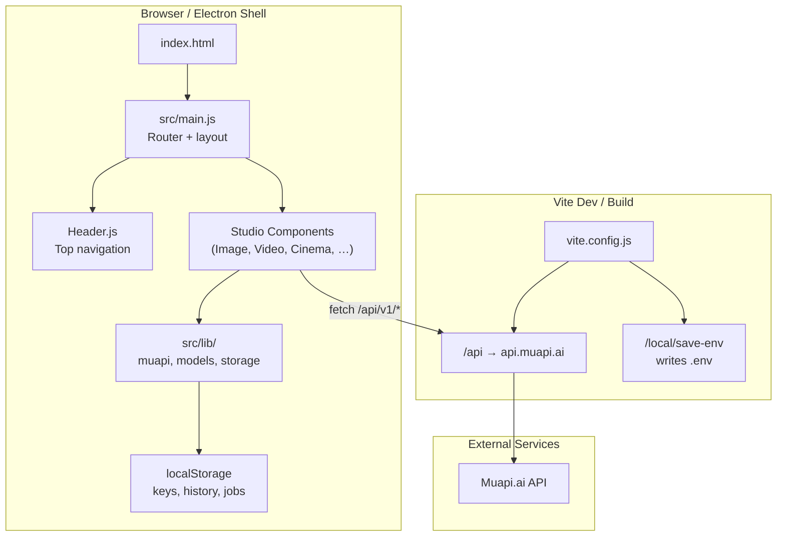
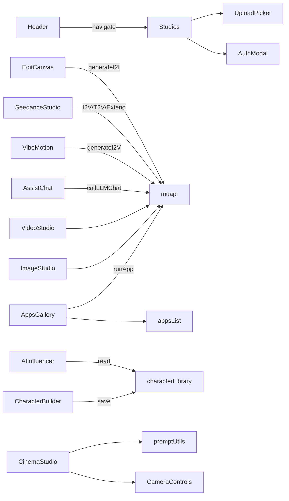
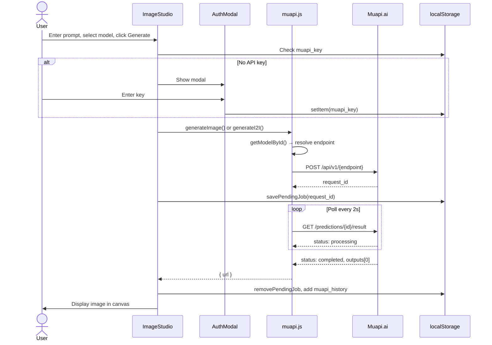
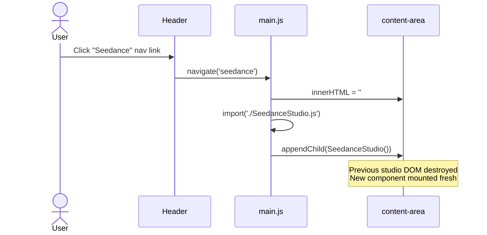
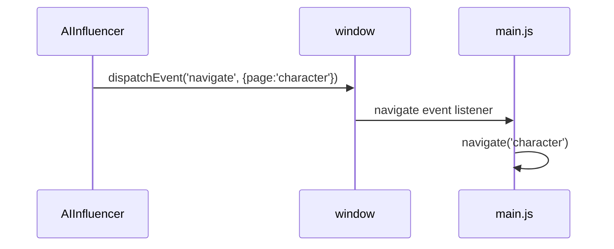
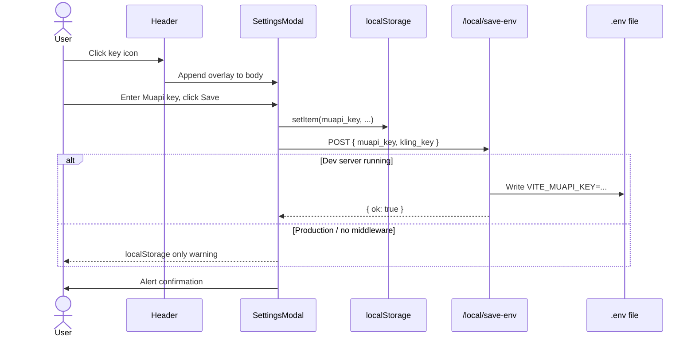

# Open Higgsfield AI — Repository Guide

> Comprehensive technical guide for developers onboarding to this codebase.
> Last analyzed: July 2, 2026

---

## Table of Contents

1. [Project Overview](#1-project-overview)
2. [Architecture](#2-architecture)
3. [Directory Structure](#3-directory-structure)
4. [Components](#4-components)
5. [Libraries & Modules (`src/lib/`)](#5-libraries--modules-srclib)
6. [Features & Apps](#6-features--apps)
7. [Configuration](#7-configuration)
8. [Testing](#8-testing)
9. [Models & API](#9-models--api)
10. [Development Workflow](#10-development-workflow)
11. [Key Code Flows](#11-key-code-flows)
12. [WIP, Gaps & Notable Findings](#12-wip-gaps--notable-findings)

---

## 1. Project Overview

### What Is This Project?

**Open Higgsfield AI** is a free, open-source, self-hostable alternative to the proprietary [Higgsfield AI](https://higgsfield.ai) platform. It provides a unified creative studio for AI-powered:

- Image generation (text-to-image, image-to-image)
- Video generation (text-to-video, image-to-video, video-to-video)
- Lip sync (portrait + audio, video + audio)
- Audio (TTS, music)
- Cinema-style shots with virtual camera controls
- One-click "Apps" (effects, upscaling, face swap, etc.)
- Character creation and social-content workflows

All generation runs through **[Muapi.ai](https://muapi.ai)** — a unified API gateway for 200+ commercial and open models (Flux, Kling, Sora, Veo, Seedance, etc.).

### Target Users

| Audience | Use Case |
|----------|----------|
| Creators / marketers | Generate images, videos, and social content without subscriptions |
| Developers | Fork, extend UI, add models, self-host |
| Desktop users | Pre-built Electron installers (macOS DMG, Windows NSIS) |

### Tech Stack

| Layer | Technology |
|-------|------------|
| Build tool | [Vite 5](https://vitejs.dev/) |
| UI framework | **Vanilla JavaScript** — no React/Vue; components are factory functions returning DOM nodes |
| Styling | [Tailwind CSS v4](https://tailwindcss.com/) via `@tailwindcss/vite` |
| API gateway | Muapi.ai (`https://api.muapi.ai`) |
| Desktop | Electron 33 + electron-builder |
| E2E testing | Puppeteer (Seedance smoke tests) |
| Runtime | Node.js 18+ |

### How to Install & Run

#### Web (development)

```bash
git clone https://github.com/Anil-matcha/Open-Higgsfield-AI.git
cd Open-Higgsfield-AI
npm install
npm run dev # Vite dev server → http://localhost:5173
```

Optional: create `.env` with `VITE_MUAPI_KEY=your_key` (seeded into `localStorage` on first load).

#### Windows launcher

`launch-higgsfield.bat`:
- Checks Node.js
- Runs `npm install` if needed
- Starts Vite on **port 3006** (`http://localhost:3006`)
- Opens browser after ~5 seconds

#### Production & desktop

| Script | Purpose |
|--------|---------|
| `npm run build` | Vite production build → `dist/` |
| `npm run preview` | Preview production build |
| `npm run electron:dev` | Build + launch Electron |
| `npm run electron:build` | macOS DMG (x64 + arm64) |
| `npm run electron:build:win` | Windows NSIS installer |
| `npm run electron:build:all` | Both platforms |
| `npm run test:seedance` | Puppeteer smoke tests for Seedance Studio |

Pre-built binaries: [GitHub Releases](https://github.com/Anil-matcha/Open-Higgsfield-AI/releases)

---

## 2. Architecture

### High-Level Architecture



### Entry Points

| File | Role |
|------|------|
| `index.html` | HTML shell; mounts `#app`, loads `/src/main.js` |
| `src/main.js` | App bootstrap, manual router, initial route `image` |
| `vite.config.js` | Tailwind plugin, API proxy, `.env` save middleware |
| `electron/main.js` | Electron window loading `dist/index.html` |

### Routing / Navigation Model

There is **no SPA framework router**. Navigation is manual:

1. `main.js` defines `navigate(page)` — clears `#content-area`, mounts the matching studio component.
2. Most routes use **dynamic `import()`** for code-splitting (except `ImageStudio`, loaded eagerly).
3. `Header.js` receives `navigate` and calls it on nav link clicks.
4. Global `window` event: `navigate` with `{ detail: { page } }` — used by `Sidebar.js` (unused) and cross-component navigation (e.g. AI Influencer → Character Builder).
5. `page === 'settings'` opens `SettingsModal` as an overlay instead of swapping content.

**Registered routes** (`main.js`):

| Route key | Component |
|-----------|-----------|
| `image` | `ImageStudio` |
| `video` | `VideoStudio` |
| `cinema` | `CinemaStudio` |
| `lipsync` | `LipSyncStudio` |
| `audio` | `AudioStudio` |
| `apps` | `AppsGallery` |
| `character` | `CharacterBuilder` |
| `assist` | `AssistChat` |
| `vibemotion` | `VibeMotion` |
| `influencer` | `AIInfluencer` |
| `edit` | `EditCanvas` |
| `seedance` | `SeedanceStudio` |

### State Management

No Redux/Zustand. State is **component-local closure variables** plus **browser storage**:

| Storage key | Purpose |
|-------------|---------|
| `muapi_key` | Muapi API key (required) |
| `kling_key` | Kling API key (optional, stored but not yet wired to API calls) |
| `muapi_history` | Image generation history (max 50) |
| `video_history` | Video history (max 30) |
| `cinema_history` | Cinema history (max 50) |
| `lipsync_history` | Lip sync history (max 30) |
| `muapi_uploads` | Upload history with thumbnails (max 20) |
| `muapi_pending_jobs` | In-flight generation jobs for resume-on-reload |
| `character_library` | Saved AI characters |
| `seedance_last_request_id` | Session storage for Seedance remix chain |

### API Integration Layer

`src/lib/muapi.js` — singleton `MuapiClient` exported as `muapi`.

**Universal pattern:** Submit → Poll → Normalize URL

1. `POST /api/v1/{endpoint}` with JSON body + `x-api-key` header
2. Receive `request_id`
3. Poll `GET /api/v1/predictions/{request_id}/result` until `completed` / `failed`
4. Extract output from `outputs[0]`, `url`, or `output.url`

**Dev vs prod base URL:**
- Dev: `baseUrl = ''` (requests go through Vite proxy `/api`)
- Prod: `baseUrl = 'https://api.muapi.ai'`

**Key methods:**

| Method | Use |
|--------|-----|
| `generateImage()` | T2I |
| `generateI2I()` | I2I (supports `images_list`, per-model `imageField`) |
| `generateVideo()` | T2V, extend, remix |
| `generateI2V()` | I2V |
| `processV2V()` | Video-to-video tools |
| `processLipSync()` | Lip sync models |
| `generateAudio()` | TTS / music / SFX |
| `runApp()` | Generic one-shot app endpoints |
| `uploadFile()` | Multipart upload → hosted URL |
| `callLLM()` / `callLLMChat()` | `any-llm` endpoint |
| `generateFaceId()` | Flux PuLID for character faces |
| `pollForResult()` | Shared polling (also used for job resume) |

Model endpoints are resolved via `src/lib/models.js` lookup helpers.

---

## 3. Directory Structure

```
Open-Higgsfield-AI/
├── index.html                    # HTML entry
├── package.json                  # Scripts, Electron builder config
├── vite.config.js                # Vite + Tailwind + API proxy + save-env
├── launch-higgsfield.bat         # Windows one-click launcher (port 3006)
├── README.md                     # User-facing docs (partially outdated vs code)
├── project_knowledge.md          # Internal docs (outdated — pre-new features)
│
├── electron/
│   └── main.js                   # Electron shell (loads dist/index.html)
├── afterPack.js                  # electron-builder hook
│
├── public/                       # Static assets (banner.png, cinema images)
├── docs/assets/                  # README screenshots
│
├── src/
│   ├── main.js                   # App entry + router
│   ├── style.css                 # Tailwind imports + #app layout
│   ├── styles/
│   │   ├── global.css            # Resets, fonts, animations
│   │   ├── studio.css            # Studio-specific styles
│   │   └── variables.css         # CSS custom properties (colors, blur)
│   ├── components/               # UI modules (see §4)
│   └── lib/                      # Shared logic (see §5)
│
├── models_dump.json              # Raw model schema dump (source for models.js)
├── models_dump.json.backup
│
├── scripts/
│   ├── test-model-endpoints.js   # Batch API deprecation tester
│   └── test-results/             # JSON + MD test output
│
├── tests/
│   ├── seedance.test.js          # Puppeteer UI smoke tests
│   └── screenshots/              # Test artifacts
│
├── deprecated-models-analysis.md # Heuristic superseded-model list
├── potentially-deprecated-models.md
├── DEPRECATED_MODELS_REMOVED.md  # Removal changelog (2026-04-09)
├── test-deprecated-models-plan.md
│
└── release/                      # Electron build output (when built)
```

---

## 4. Components

All components live in `src/components/`. Each exports a factory function (e.g. `export function ImageStudio()`) that returns a DOM `HTMLElement`.

### Component Inventory

| Component | File | Purpose | Key Dependencies |
|-----------|------|---------|------------------|
| **Header** | `Header.js` | Sticky top nav, settings key button | `SettingsModal`, `navigate()` |
| **ImageStudio** | `ImageStudio.js` | Dual-mode T2I/I2I studio, multi-image, history, pending job resume | `muapi`, `models.js`, `UploadPicker`, `AuthModal`, `pendingJobs` |
| **VideoStudio** | `VideoStudio.js` | T2V / I2V / V2V modes, extend/remix support | Same pattern as ImageStudio |
| **CinemaStudio** | `CinemaStudio.js` | Cinematic shot generator with camera overlay | `CameraControls`, `promptUtils`, `muapi` |
| **LipSyncStudio** | `LipSyncStudio.js` | Portrait or video + audio → talking video | `lipsyncModels`, `UploadPicker` |
| **AudioStudio** | `AudioStudio.js` | TTS / Music / SFX tabs | `ttsModels`, `musicModels`, `sfxModels` |
| **AppsGallery** | `AppsGallery.js` | Grid of one-click tools; auto-generated forms | `appsList.js`, `muapi.runApp()` |
| **CharacterBuilder** | `CharacterBuilder.js` | Create reusable characters (PuLID + LLM backstory) | `characterLibrary`, `muapi` |
| **AssistChat** | `AssistChat.js` | Creative copilot chat UI | `muapi.callLLMChat()` |
| **VibeMotion** | `VibeMotion.js` | Image + motion preset → I2V video, optional Suno mood audio | `i2vModels`, `muapi` |
| **AIInfluencer** | `AIInfluencer.js` | Social content from saved characters | `characterLibrary`, image gen |
| **EditCanvas** | `EditCanvas.js` | Canvas inpaint / erase / outpaint with mask drawing | `i2iModels` (edit subset) |
| **SeedanceStudio** | `SeedanceStudio.js` | Seedance 2.0 workflows: character swap, remix, variations | `muapi.generateI2V/Video` |
| **UploadPicker** | `UploadPicker.js` | Reusable upload button + history panel (single/multi image) | `uploadHistory`, `muapi.uploadFile` |
| **CameraControls** | `CameraControls.js` | Scrollable camera/lens/focal/aperture picker | `promptUtils`, cinema assets |
| **AuthModal** | `AuthModal.js` | First-run API key capture | `localStorage.muapi_key` |
| **SettingsModal** | `SettingsModal.js` | Muapi + Kling key management, `.env` persistence | `/local/save-env` endpoint |
| **Sidebar** | `Sidebar.js` | Alternate nav (Image/Video/Library/Settings) — **not mounted in main.js** |

### UI Patterns

- **Hero + prompt bar + generate**: Image, Video, Lip Sync, Audio studios share this layout.
- **Glassmorphism dark theme**: `bg-[#111]/90`, `backdrop-blur`, neon primary `#d9ff00`.
- **Dynamic controls**: Aspect ratio, resolution, quality, duration pickers appear based on selected model's `inputs` schema in `models.js`.
- **Mode switching**: Uploading a reference image auto-switches Image Studio to I2I models; Video Studio switches T2V ↔ I2V ↔ V2V.
- **History sidebar**: Fixed right rail with thumbnails (Image, Video, Lip Sync, Cinema).
- **Modals/overlays**: Settings, Apps, Cinema camera controls, Auth.
- **Lazy loading**: Route components loaded via `import()` except ImageStudio.

### Component Relationships



---

## 5. Libraries & Modules (`src/lib/`)

| Module | File | Description |
|--------|------|-------------|
| **models.js** | `models.js` | **Source of truth** for all model definitions (~8,000 lines). Auto-generated from `models_dump.json`. Exports category arrays + lookup helpers. |
| **muapi.js** | `muapi.js` | HTTP client for Muapi.ai (see §2). |
| **appsList.js** | `appsList.js` | Declarative registry of 18 one-click apps in 5 categories with input schemas for auto-form generation. |
| **characterLibrary.js** | `characterLibrary.js` | CRUD for saved characters in `localStorage`. |
| **uploadHistory.js** | `uploadHistory.js` | Upload history + canvas thumbnail generation. |
| **pendingJobs.js** | `pendingJobs.js` | Persist in-flight `request_id`s for resume after page reload. |
| **promptUtils.js** | `promptUtils.js` | Cinema camera/lens/focal/aperture → prompt string (`buildNanoBananaPrompt`). |
| **models.js.backup** | backup | Pre-deprecation-removal snapshot. |

### `models.js` Structure

```javascript
export const t2iModels = [...];   // Text-to-Image
export const i2iModels = [...];   // Image-to-Image
export const t2vModels = [...];   // Text-to-Video
export const i2vModels = [...];   // Image-to-Video
export const v2vModels = [...];   // Video-to-Video
export const lipsyncModels = [...]; // Lip sync (category: 'image' | 'video')
export const ttsModels = [...];   // Text-to-Speech (2 models)
export const musicModels = [...]; // Suno music (3 models)
export const sfxModels = [...];   // EMPTY — deprecated models removed
```

**Helper functions:** `getModelById`, `getI2IModelById`, `getVideoModelById`, `getI2VModelById`, `getV2VModelById`, `getLipSyncModelById`, `getAspectRatiosForModel`, `getMaxImagesForI2IModel`, `getQualityFieldForModel`, etc.

Each model object typically includes:
- `id`, `name`, `endpoint` (API path segment)
- `inputs` — JSON-schema-like field definitions (`enum`, `default`, `type`)
- I2I/I2V: optional `imageField` (`image_url` vs `images_list`)
- Lip sync: `category: 'image' | 'video'`

---

## 6. Features & Apps

### Core Studios (routed in `main.js`)

| Feature | Route | Description |
|---------|-------|-------------|
| Image Studio | `image` | 46 T2I + 57 I2I models; multi-image up to 14 |
| Video Studio | `video` | 48 T2V + 65 I2V + 5 V2V; extend/remix for Seedance |
| Lip Sync | `lipsync` | 9 models, image or video input modes |
| Cinema Studio | `cinema` | Virtual camera controls → enhanced prompts |
| Audio Studio | `audio` | Minimax TTS + Suno music (SFX tab empty) |
| Edit Canvas | `edit` | Inpaint, erase, outpaint with mask canvas |
| Character Builder | `character` | PuLID face + LLM backstory |
| AI Influencer | `influencer` | Platform-specific social content from characters |
| Vibe Motion | `vibemotion` | Motion presets + optional mood music → I2V |
| Assist | `assist` | LLM creative copilot |
| Seedance Studio | `seedance` | Character Swap, Remix, Variations (Seedance 2.0) |
| Apps | `apps` | 18 one-click tools |

### Apps Registration (`appsList.js`)

Apps are **not dynamically discovered** — they are statically declared in `appCategories`:

| Category | Count | Examples |
|----------|-------|----------|
| Image Effects | 4 | Artistic Effects, Ghibli Style, Anime, Portrait Stylist |
| Image Tools | 6 | Background Remover, Upscaler, Colorize, Skin Enhancer |
| Face Tools | 2 | Face Swap, Change Outfit |
| Video Effects | 4 | Video Effects, VFX, Camera Motion, Upscale Video |
| Social & Product | 2 | Product Shot, Auto Captions |

`AppsGallery.js` reads `appCategories`, renders cards, and on click builds a form from each app's `inputs` schema, then calls `muapi.runApp(app.id, payload)`.

---

## 7. Configuration

### Environment Variables

| Variable | Set via | Purpose |
|----------|---------|---------|
| `VITE_MUAPI_KEY` | `.env` or Settings modal | Seeded to `localStorage` on boot |
| `VITE_KLING_KEY` | `.env` or Settings modal | Optional; stored but unused in API layer |
| `MUAPI_KEY` | Shell env | Used by `scripts/test-model-endpoints.js` |

### Settings Modal (`SettingsModal.js`)

- Stores keys in `localStorage` (`muapi_key`, `kling_key`)
- In dev, POSTs to `/local/save-env` (Vite middleware in `vite.config.js`) to persist `.env`

### `vite.config.js` Specifics

```javascript
base: './'  // Relative paths for Electron file:// loading
plugins: [tailwindcss(), saveEnvPlugin()]
server.proxy['/api'] → 'https://api.muapi.ai'  // CORS bypass in dev
```

The `saveEnvPlugin` writes `VITE_MUAPI_KEY` and `VITE_KLING_KEY` to project-root `.env`.

### Electron Notes

- `webSecurity: false` — allows `file://` origin to call external APIs in packaged app
- Loads built `dist/index.html` (must run `vite build` first)

---

## 8. Testing

### `tests/seedance.test.js`

- **Runner:** `npm run test:seedance`
- **Requires:** Dev server at `http://localhost:5173`
- **Tool:** Puppeteer (headless)
- **Coverage:** Seedance Studio UI smoke tests:
  1. Character Swap tab — upload zone, selects, generate button
  2. Remix tab — request ID input, remix button
  3. Variations tab — count selector (2/3/4), parallel generation UI
- **Artifacts:** Screenshots in `tests/screenshots/`

### `scripts/test-model-endpoints.js`

- **Runner:** `node scripts/test-model-endpoints.js` (with `MUAPI_KEY` or `VITE_MUAPI_KEY`)
- **Purpose:** Batch-test all model endpoints for 404/deprecation
- **Output:**
  - `scripts/test-results/deprecated-models.json`
  - `scripts/test-results/deprecated-models.md`
- **Last run (2026-04-09):** 244 models tested; 9 confirmed deprecated (404), removed from codebase

---

## 9. Models & API

### Model Counts (post-cleanup, per `DEPRECATED_MODELS_REMOVED.md`)

| Category | Count |
|----------|-------|
| Text-to-Image (`t2iModels`) | 46 |
| Image-to-Image (`i2iModels`) | 57 |
| Text-to-Video (`t2vModels`) | 48 |
| Image-to-Video (`i2vModels`) | 65 |
| Video-to-Video (`v2vModels`) | 5 |
| Lip Sync (`lipsyncModels`) | 9 |
| TTS (`ttsModels`) | 2 |
| Music (`musicModels`) | 3 |
| SFX (`sfxModels`) | **0** (empty) |
| **Core total** | **230** |
| **With audio** | **235** |

### `models_dump.json` Role

- JSON snapshot of Muapi model input schemas, organized by category keys (`t2i`, `i2i`, etc.)
- Used as the generation source for `models.js` (comment at top: `// Auto-generated from models_dump.json`)
- Smaller than `models.js` — not all runtime models may exist in dump
- Backup: `models_dump.json.backup`

### Deprecated Models Workflow

1. **Analysis:** `deprecated-models-analysis.md` — heuristic list of superseded models (not necessarily 404)
2. **Testing:** `scripts/test-model-endpoints.js` — live API probe
3. **Results:** `scripts/test-results/deprecated-models.md`
4. **Removal:** `DEPRECATED_MODELS_REMOVED.md` — 9 models removed (2026-04-09)
5. **Backups:** `src/lib/models.js.backup`, `models_dump.json.backup`

**Removed models (404 confirmed):** `flux-dev-lora`, `hidream-i1-*`, `bytedance-seedream-v3`, `image-passthrough`, `Api Node`, `seedance-v2.0-omni-reference`, `mmaudio-v2-text-to-audio`

---

## 10. Development Workflow

### `package.json` Scripts

| Script | Command |
|--------|---------|
| `dev` | `vite` |
| `build` | `vite build` |
| `preview` | `vite preview` |
| `electron:dev` | `vite build && electron .` |
| `electron:build` | macOS DMG |
| `electron:build:win` | Windows NSIS |
| `electron:build:all` | Both platforms |
| `test:seedance` | `node tests/seedance.test.js` |

### Current Git State (active development)

Many **untracked new feature files** indicate ongoing expansion beyond original README scope:

- New components: `AudioStudio`, `AppsGallery`, `AssistChat`, `CharacterBuilder`, `EditCanvas`, `SeedanceStudio`, `VibeMotion`, `AIInfluencer`
- New libs: `appsList.js`, `characterLibrary.js`
- Model maintenance: `models_dump.json`, deprecation scripts and docs
- Tests: `tests/seedance.test.js`, screenshots

Modified tracked files: `Header.js`, `SettingsModal.js`, `models.js`, `muapi.js`, `main.js`, `vite.config.js`, `package.json`

### Adding a New Model

1. Add entry to `models_dump.json` (or directly to `models.js`)
2. Ensure `id`, `name`, `endpoint`, and `inputs` schema are correct
3. For I2I/I2V: set `imageField` if not `image_url`
4. Run `scripts/test-model-endpoints.js` to verify endpoint availability

### Adding a New App

1. Add object to appropriate category in `appsList.js` with `id`, `inputs` schema
2. `AppsGallery` auto-generates the form — no route registration needed

### Adding a New Top-Level Feature

1. Create component in `src/components/`
2. Add route branch in `main.js` `navigate()`
3. Add nav item + click handler in `Header.js`

---

## 11. Key Code Flows

### Flow 1: Select Model & Generate Image



### Flow 2: Navigate Between Apps



Alternative path for cross-component navigation:



### Flow 3: Settings / API Key Configuration



On next app boot (`main.js`):

```javascript
if (import.meta.env.VITE_MUAPI_KEY && !localStorage.getItem('muapi_key')) {
  localStorage.setItem('muapi_key', import.meta.env.VITE_MUAPI_KEY);
}
```

---

## 12. WIP, Gaps & Notable Findings

### Incomplete / Placeholder UI

| Item | Status |
|------|--------|
| Header: **Explore**, **Contests**, **Community** | Rendered but **no click handlers** |
| `Sidebar.js` | Implemented but **not imported** in `main.js` |
| `kling_key` | Stored in Settings; `getKlingKey()` exists but **never used** in generation |
| `sfxModels` | **Empty array** — SFX tab in Audio Studio has no models |
| `project_knowledge.md` | Outdated (pre-Audio, Apps, Character, etc.) |
| README architecture tree | Missing newer components |

### Documentation Drift

- README claims "20+ models" in meta; codebase has **230+** model entries
- `counter.js` appears to be Vite template leftover (unused)

### Security Notes

- API keys stored in `localStorage` (client-side only; sent only to Muapi)
- Electron disables `webSecurity` for API access from packaged app
- `.env` write endpoint (`/local/save-env`) is **dev-only** Vite middleware

### Active Feature Chain

Character Builder → Character Library → AI Influencer is the most integrated cross-feature pipeline. Seedance Studio chains I2V → Extend remix via `sessionStorage` request IDs.

---

## Quick Reference: Key Paths

| Resource | Path |
|----------|------|
| Entry | `src/main.js` |
| Router | `src/main.js` (lines 14–65) |
| API client | `src/lib/muapi.js` |
| Models | `src/lib/models.js` |
| Apps registry | `src/lib/appsList.js` |
| Vite config | `vite.config.js` |
| Windows launcher | `launch-higgsfield.bat` |
| Seedance tests | `tests/seedance.test.js` |
| Model endpoint tests | `scripts/test-model-endpoints.js` |
